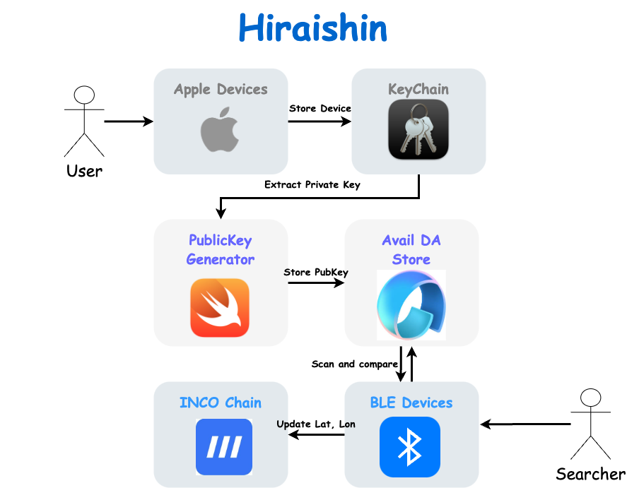

<div align="center">
<h1>Hiraishin</h1>
<p>Helping Your Furry Friends Find Their Way Home, Airtag DePIN social finding network</p>

</img>

[](./LICENSE)
</div>

### Demo Page
- WebPage: https://hiraishin.pages.dev/
- Contract: [0xacCe510e129a9c9E07EC496c923D3beFBDF9E551](https://explorer.testnet.inco.org/address/0xacCe510e129a9c9E07EC496c923D3beFBDF9E551)

### Abstract
Slogan: "Helping Your Furry Friends Find Their Way Home"

Imagine a world where losing your beloved dog doesn't mean losing hope. Our innovative project leverages the principles of Apple’s AirTag technology combined with the security of blockchain to create a community-driven network for locating lost pets.

### Problem Statement:

1. High Incidence of Lost Pets:
Losing a pet is a common and distressing experience for many pet owners. The current methods for finding lost pets, such as posting flyers or relying on social media, are often inefficient and ineffective.

2. Lack of Real-Time Tracking:
Traditional methods lack real-time tracking capabilities, making it difficult to pinpoint the exact location of a lost pet. This delay can significantly reduce the chances of finding the pet quickly and safely.

3. Limited Community Involvement:
Without a structured system to incentivize community involvement, there is often a lack of motivation for people to actively participate in searching for lost pets. This limits the potential for a coordinated and effective search effort.

### Solution:

1. Blockchain-Enabled Tracking Network:
Our solution utilizes a blockchain-based network to securely and accurately track lost pets. By leveraging Apple’s AirTag technology and combining it with blockchain, we provide a robust and tamper-proof system for real-time location tracking.

2. Real-Time Updates and Encryption:
The system uses homomorphic encryption to ensure that location data is securely transmitted and stored on the Inco blockchain. Users can report sightings and update the pet's location in real-time, significantly improving the chances of a swift reunion.

3. Incentivized Community Participation:
To foster active community involvement, we implement a rewards system within the app. Users earn rewards for contributing to the search efforts, creating a motivated and engaged network of pet lovers dedicated to bringing lost pets home.

### Benefit

Pet Owners’ Peace of Mind: Attach a small, AirTag-like device to your dog's collar. If your dog goes missing, report it through our user-friendly app.
Community Engagement: Our network of users, incentivized by rewards, springs into action to help locate your missing pet.
Real-Time Updates: Users report sightings and location updates, which are securely tracked and verified through our blockchain system.

### Problem
Some user cannot generate gena, but can use v_Data to extract the private key, follow my gist to solve this problem
https://gist.github.com/kidneyweakx/bc994984c77654986eb978ca489a443c

### How to use this package
| hiraishin is a monorepo managed using `turbo`. You can find the source code for each package in the [`apps`](./apps/) and [`packages`](./packages/) directory.

- `apps`
  + findmydog: a python lib to find ur dog
  + location-da: DA part to send data to avail
  + web: frontend to make user to update location or get reward
  

### Step By Step
1. findmydog
```
cd apps/findmydog
chmod +x ./extract_key.swift
./extract_key.swift

### Copy ur devices to plist
cp xxxx.plist ./decrypted.plist
```

Python part
```
poetry install
# Need to jump to step 2 to run an avail server
poetry run python publickey_gen.py
```

2. avail server
```
cd apps/location-da
pnpm run avail
npx ts-node ./src/app.ts
```

3. contract
```
npx hardhat deploy:enc --network inco
```

### Arch
